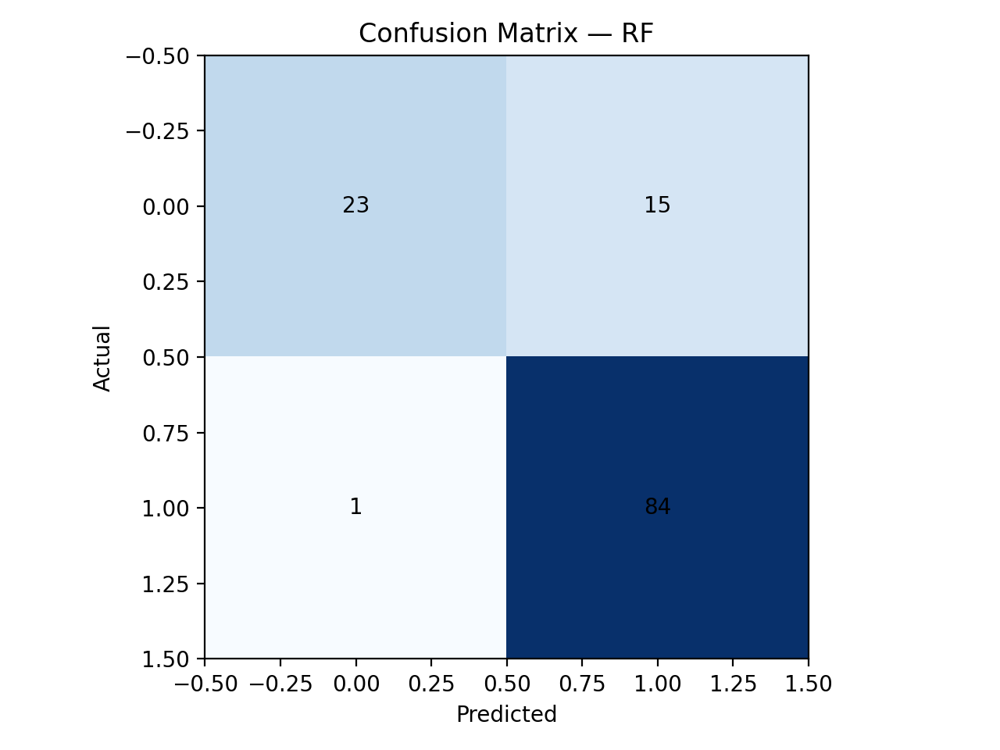
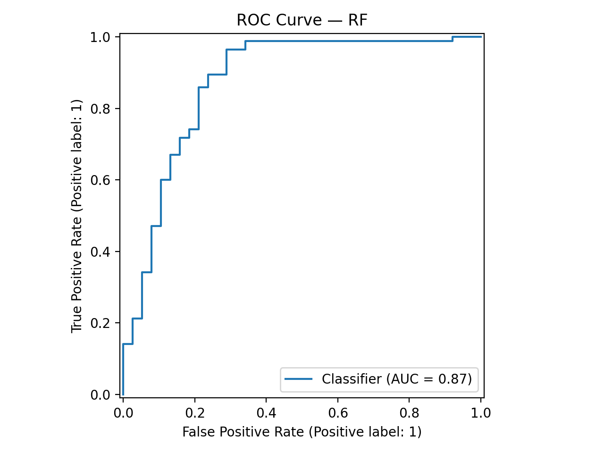
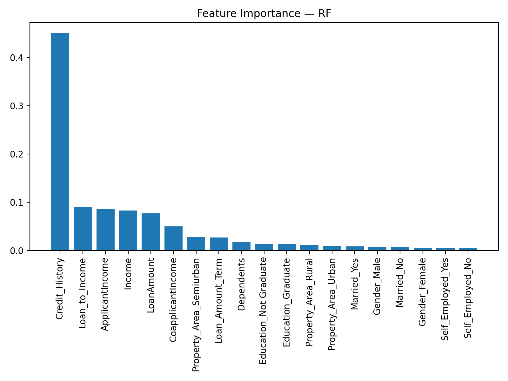

# 💳 Loan Approval Intelligence  
### *Smarter Lending Decisions, Powered by AI*  

  
  
  
  
  

🚀 Built by **Mubasshir Ahmed** — *Enhanced Version*  

---

## 📌 Overview
**Loan Approval Intelligence** is a Machine Learning system that predicts whether a loan application will be **Approved ✅** or **Rejected ⚠️**, based on financial and demographic details of the applicant.

This project delivers:
- 📊 **Data Science Pipeline** — reproducible preprocessing & model training  
- 🤖 **ML Models Benchmarking** — Logistic Regression, Random Forest, XGBoost & more  
- 🌐 **Flask Web App** — elegant UI for real-time predictions  
- 📈 **Evaluation Dashboard** — metrics, confusion matrix, ROC curves & feature importance  

---

## 📊 Dataset
**Key Features**:
- Demographics: `Gender`, `Married`, `Dependents`, `Education`, `Self_Employed`  
- Financials: `ApplicantIncome`, `CoapplicantIncome`, `LoanAmount`, `Loan_Amount_Term`, `Credit_History`, `Property_Area`  
- Engineered: `Income`, `Loan_to_Income`  
- **Target**: `Loan_Status` → 1 = Approved, 0 = Rejected  

---

## 🔎 Workflow
1. **EDA & Cleaning** → Null handling, feature engineering (`Income`, `Loan_to_Income`)  
2. **Preprocessing** → `ColumnTransformer` with One-Hot Encoding + Scaling  
3. **Modeling** → Benchmarked 8 models with hyperparameter tuning  
4. **Evaluation** → Compared Accuracy, Precision, Recall, F1, ROC-AUC  
5. **Deployment** → Flask app with interactive UI  

---

## 🏆 Results

📌 **Best Model → Random Forest (RF)**  
- **F1 Score:** 0.913  
- **ROC-AUC:** 0.874  
- **Accuracy:** 86.99%  

| Model        | Accuracy | Precision | Recall | F1    | ROC-AUC |
|--------------|----------|-----------|--------|-------|---------|
| **Random Forest (RF)** 🏆 | **0.870** | 0.848 | **0.988** | **0.913** | **0.874** |
| Logistic Regression | 0.862 | 0.840 | **0.988** | 0.908 | 0.872 |
| KNN           | 0.862 | 0.847 | 0.976 | 0.907 | 0.844 |
| Gradient Boosting | 0.854 | 0.853 | 0.953 | 0.900 | 0.850 |
| SVC           | 0.846 | 0.824 | **0.988** | 0.898 | 0.865 |
| AdaBoost      | 0.854 | **0.885** | 0.906 | 0.895 | 0.848 |
| Decision Tree | 0.846 | 0.844 | 0.953 | 0.895 | 0.807 |
| XGBoost       | 0.813 | 0.860 | 0.871 | 0.865 | 0.815 |

---

## 📈 Visualizations
- Confusion Matrix  
    
- ROC Curve  
    
- Feature Importance  
    

🎥 **UI Demo**  
  

---

## 🛠️ Tech Stack
- **Python 3.9+**  
- **Flask** (Web App)  
- **scikit-learn** (ML Models)  
- **XGBoost** (Boosting)  
- **pandas, numpy, matplotlib** (Data/EDA)  
- **joblib** (Model Persistence)  

---

## 📂 Project Structure
```
06_Loan_Approval_Intelligence/
├─ app/
│  ├─ models/
│  │  └─ best_model.pkl
│  ├─ static/
│  │  └─ styles.css
│  ├─ templates/
│  │  └─ index.html
│  └─ app.py
├─ data/
│  └─ Loan_Data.csv
├─ notebook/
│  └─ loan_approval_intelligence.ipynb
├─ results/
│  ├─ confusion_matrix.png
│  ├─ correlation_heatmap.png
│  ├─ example_predictions.csv
│  ├─ feature_importance.png
│  ├─ metrics_table.csv
│  ├─ metrics.json
│  ├─ roc_curve.png
│  ├─ target_balance.png
│  └─ UI_overview.gif
└─ requirements.txt
```

---

## 🚀 Getting Started
```bash
# Clone repo
git clone https://github.com/mubasshirahmed-3712/Loan-Approval-Intelligence.git
cd Loan-Approval-Intelligence

# Install dependencies
pip install -r requirements.txt

# Run app
cd app
python app.py
```
Visit: [http://127.0.0.1:5000](http://127.0.0.1:5000)

---

## 🌐 Deployment
Deploy on **Render / Railway / Heroku**:  
- Entrypoint: `app/app.py`  
- Dependencies: `requirements.txt`  
- Add `gunicorn` in requirements for production.  

*(Live Demo badge will go here once deployed)*  

---

## ✨ Author
👤 **Mubasshir Ahmed**  
💡 *Data Science Enthusiast | ML Engineer in Progress*  

📌 Connect with me on [LinkedIn](https://www.linkedin.com/) | [GitHub](https://github.com/mubasshirahmed-3712)  

---
